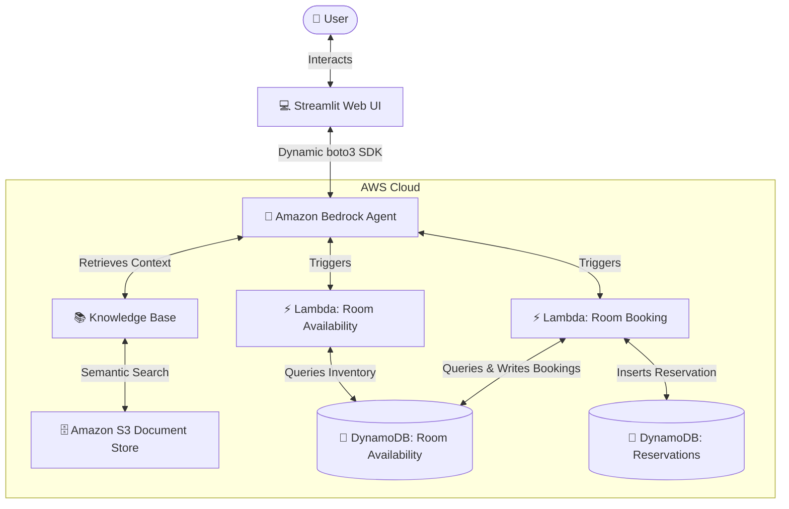
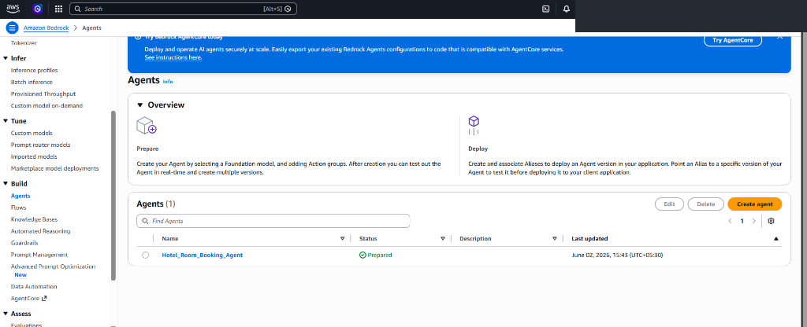
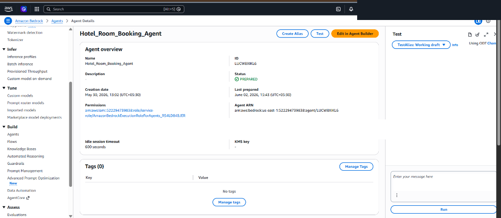
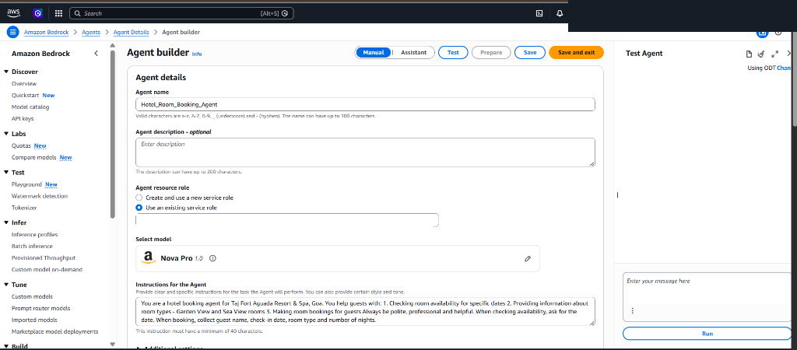
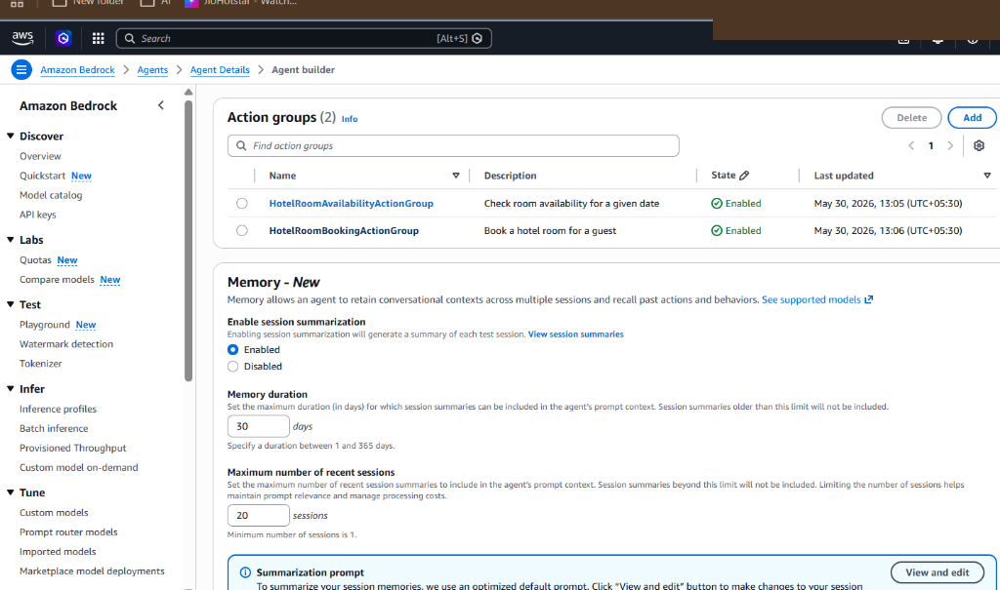
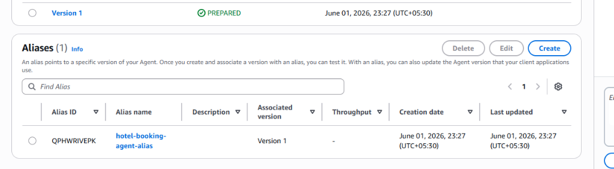
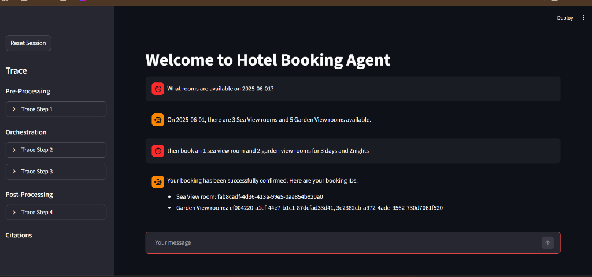
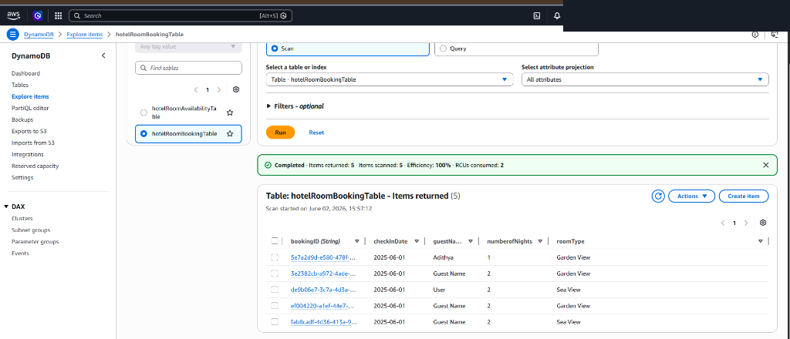

# Hotel Room Booking Agent using Amazon Bedrock

An advanced, recruiter-ready, serverless AI Conversational Assistant designed to streamline hotel room bookings. Powered by **Amazon Bedrock Agents**, the system orchestrates user inquiries, checks room availability in real-time, processes multi-room bookings, and dynamically handles context-rich queries using **Amazon Bedrock Knowledge Bases**. Backed by **AWS Lambda** serverless functions and **Amazon DynamoDB** databases, it represents a state-of-the-art enterprise-grade AI integration.

---

## 🏗️ System Architecture

The following architectural workflow illustrates the end-to-end integration:



### Architectural Flow:
1. **User Interaction**: The user enters a request (e.g., *"What rooms are available for June 1st, 2025?"* or *"Book a Sea View room"*).
2. **Agent Orchestration**: **Amazon Bedrock Agent** processes the query, decides whether to trigger an action group or query the knowledge base, and orchestrates the workflow.
3. **Knowledge Retrieval**: If general details are requested (e.g. hotel policies, pricing brochures), the agent searches the **Bedrock Knowledge Base** backed by **Amazon S3** document storage.
4. **Action Execution**: When availability checks or bookings are requested, the agent invokes the corresponding **AWS Lambda** action group.
5. **Data Persistence**: The serverless Lambda functions interact with **Amazon DynamoDB** to check available room counts, update room inventories, and record reservation details under a unique UUID-based booking ID.

---

## 🛠️ AWS Services Utilized

*   **Amazon Bedrock Agents**: Orchestrates multi-step workflows, manages session context memory, and coordinates LLM execution using model-directed action routing.
*   **Amazon Bedrock Knowledge Base**: Performs semantic vector searches on unstructured documents (such as resort maps and pricing policies) stored in S3.
*   **AWS Lambda**: Executes Python-based serverless functions that act as Bedrock Agent Action Groups.
*   **Amazon DynamoDB**: Low-latency NoSQL databases storing room inventory counts (`hotelRoomAvailabilityTable`) and guest reservations (`hotelRoomBookingTable`).
*   **Amazon S3**: Hosts the unstructured hotel manuals and brochures utilized as semantic sources for the Knowledge Base.

---

## ✨ Features

*   **Conversational Assistant**: Engage in natural language conversations to check room types, view lists, and request reservations.
*   **Real-time Availability Audit**: Instantly scan DynamoDB inventories for specific dates across Sea View and Garden View categories.
*   **Transactional Bookings**: Process bookings, update room availability counts, and generate unique, secure UUID-based Reservation IDs.
*   **Contextual RAG Retrieval**: Leverages Bedrock Knowledge Bases to answer complex user queries on resort amenities, check-in rules, and spa packages.
*   **Console Trace Visibility**: The Streamlit interface displays the full AWS Pre-Processing, Orchestration, and Post-Processing traces for detailed logging and debugging.

---

## 📁 Repository Directory Structure

```
├── README.md                           # Professional main documentation
├── Agent_Instructions.pdf              # AI Agent prompt engineering guidelines
├── Taj-Fort-Aguada-Resort&Spa-Goa.pdf  # Sample Knowledge Base brochure (S3)
├── .gitignore                          # Excludes secrets, venv, keys, and OS metadata
├── aws-lambda-action-groups/           # AWS Lambda Action Group configurations
│   ├── room-availability/
│   │   ├── lambda_function.py          # Lambda code for checking inventory
│   │   └── schema.yaml                 # OpenAPI YAML schema for Availability Agent
│   └── room-booking/
│       ├── lambda_function.py          # Lambda code for booking transactions
│       └── schema.yaml                 # OpenAPI YAML schema for Booking Agent
├── streamlit-chat-app/                 # Streamlit Web UI Frontend (Local or EC2)
│   ├── app.py                          # Streamlit application entrypoint
│   ├── requirements.txt                # Python pip dependencies
│   ├── Dockerfile                      # Standardized container deployment definition
│   ├── .env.template                   # Clean template for credentials configuration
│   └── services/
│       └── bedrock_agent_runtime.py    # Sanitized dynamic Bedrock invoke runtime
└── screenshots/                        # Visual proof and system walkthrough assets
    ├── agents-list.png                 # Prepared Bedrock agent listed
    ├── agent-overview.png              # Detailed agent settings view
    ├── agent-builder.png               # System prompt and model details
    ├── agent-alias.png                 # Agent release aliases list
    ├── action-groups.png               # Active Lambda action groups config
    ├── booking-demo.png                # Streamlit chat conversational booking demo
    └── dynamodb-bookings.png           # DynamoDB tables listing reservation outputs
```

---

## 🚀 Setup & Installation Instructions

### 1. Database Creation (Amazon DynamoDB)
Create two DynamoDB tables in your selected AWS Region:
1.  **Availability Table**: 
    *   **Table Name**: `hotelRoomAvailabilityTable`
    *   **Partition Key**: `date` (String)
2.  **Booking Table**: 
    *   **Table Name**: `hotelRoomBookingTable`
    *   **Partition Key**: `bookingID` (String)

Populate your availability inventory with sample records:
```json
{
  "date": "2025-06-01",
  "gardenView": "5",
  "seaView": "3"
}
```

### 2. Lambda Action Groups Setup
Deploy the python serverless codes inside the `aws-lambda-action-groups/` folder as independent AWS Lambda functions. 
*   Ensure that the Lambda functions have an execution IAM role with read/write permissions to your DynamoDB tables.
*   Import the corresponding OpenAPI schema (`schema.yaml`) when configuring the action groups in the Amazon Bedrock Console.

### 3. S3 & Knowledge Base Integration
1.  Upload the hotel manual `Taj-Fort-Aguada-Resort&Spa-Goa.pdf` into a private Amazon S3 bucket.
2.  In the Bedrock Console, create a **Knowledge Base**, select the S3 bucket as the data source, and synchronize the documents.

### 4. Running the Streamlit Web UI Locally
Navigate to the `streamlit-chat-app/` folder:
```bash
cd streamlit-chat-app
```

Install the python dependencies:
```bash
pip install -r requirements.txt
```

Create a `.env` file by copying the template:
```bash
cp .env.template .env
```

Configure your AWS credentials in `.env`:
```ini
BEDROCK_AGENT_ID=your-amazon-bedrock-agent-id
BEDROCK_AGENT_ALIAS_ID=your-amazon-bedrock-agent-alias-id
```

Run the Streamlit application:
```bash
streamlit run app.py
```

### 5. Running via Docker Container
Build the Docker image:
```bash
docker build -t bedrock-hotel-booking-ui .
```

Run the container:
```bash
docker run -p 8501:8501 --env-file .env bedrock-hotel-booking-ui
```

---

## 📸 Project Showcase (Screenshots)

### Amazon Bedrock Agent Setup

#### Bedrock Agents Workspace
Overview of the prepared agent in the Amazon Bedrock console:


#### Agent Details & Credentials
Showing model selection and ARN settings:


#### System Prompts & Instructions
Engineering the agent instructions and memory duration parameters:


#### Active Action Groups
Configured AWS Lambda action groups linking database transactions:


#### Release Alias
Showing release version mappings for client consumption:


---

### Conversational & Database Demo

#### Chat UI Booking Workflow
Streamlit assistant smoothly orchestrating room checks, reservation calculations, and outputting multiple booking confirmation UUIDs:


#### DynamoDB Reservations Table
Reservations created during the chat workflow are securely written to the database:


---

## 🔑 License
Distributed under the MIT License. See `LICENSE` for more information.
