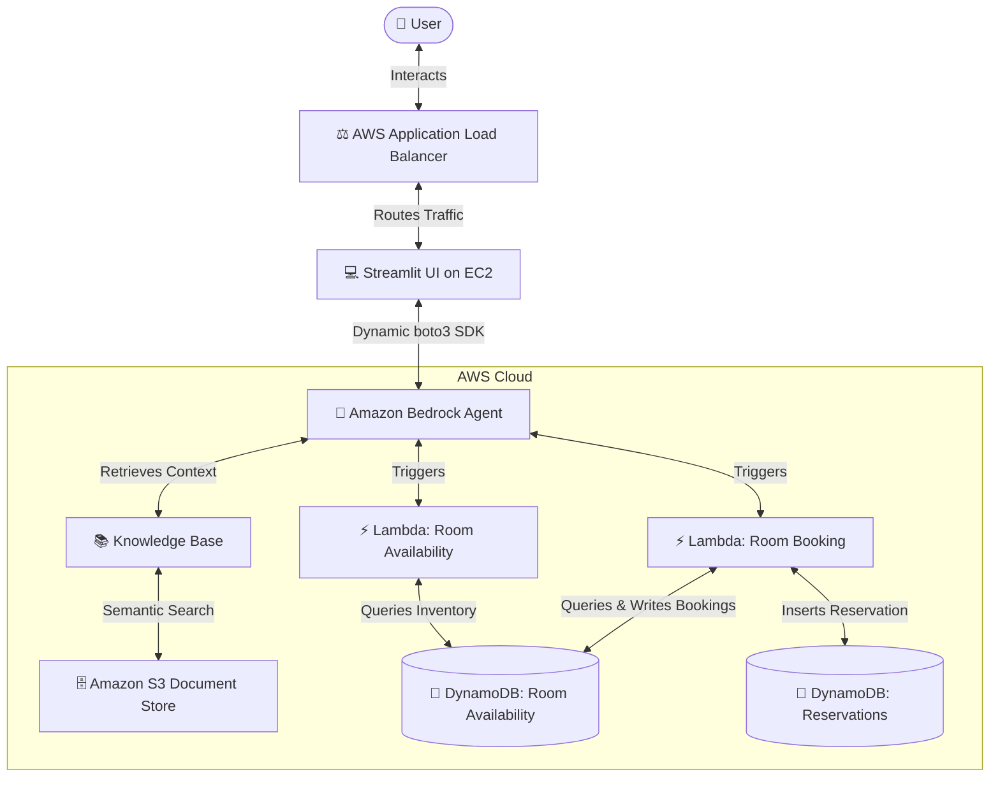

# Hotel Room Booking Agent using Amazon Bedrock

An advanced, recruiter-ready, serverless AI Conversational Assistant designed to streamline hotel room bookings. Powered by **Amazon Bedrock Agents**, the system orchestrates user inquiries, checks room availability in real-time, processes multi-room bookings, and dynamically handles context-rich queries using **Amazon Bedrock Knowledge Bases**. Backed by **AWS Lambda** serverless functions, **Amazon DynamoDB** databases, and hosted on **AWS EC2** behind an **Application Load Balancer (ALB)**, this repository represents a complete enterprise-grade serverless and containerized deployment.

---

## 🟢 Deployment Status
The project is **successfully deployed and fully tested on AWS**:
*   **Streamlit Frontend**: Containerized and hosted on an **AWS EC2** instance.
*   **Load Balancing**: Exposed via an Internet-facing **Application Load Balancer (ALB)** for public access and traffic routing.
*   **Orchestration**: Fully configured **Amazon Bedrock Agent** connected to custom Action Groups and Knowledge Bases.
*   **Database**: Real-time reservation records and room inventories persisted in **Amazon DynamoDB** tables.

---

## 🏗️ System Architecture

### High-Level Architectural Flow:
`User` ➔ `Streamlit Web UI (on EC2)` ➔ `ALB` ➔ `Amazon Bedrock Agent` ➔ `AWS Lambda (Action Groups)` ➔ `Amazon DynamoDB`

### Full Architecture Diagram:


---

## 🛠️ AWS Services Utilized

*   **Amazon Bedrock (Agents & Knowledge Base)**: Orchestrates multi-step agent workflows, maintains session memory, and performs semantic vector searches on unstructured documents (resort pricing and policies) stored in S3.
*   **AWS Lambda**: Executes Python-based serverless functions that act as Bedrock Agent Action Groups.
*   **Amazon DynamoDB**: Low-latency NoSQL databases storing room inventory counts (`hotelRoomAvailabilityTable`) and guest reservations (`hotelRoomBookingTable`).
*   **Amazon EC2**: Hosts the Streamlit frontend web application inside a Docker container.
*   **AWS Application Load Balancer (ALB)**: Exposes a public DNS endpoint and routes user traffic to the Streamlit port (8501/8080) running on the EC2 target instance.
*   **AWS Identity and Access Management (IAM)**: Manages cross-service execution roles and secure permissions policies.
*   **Amazon S3**: Hosts the unstructured hotel manuals and brochures utilized as semantic sources for the Knowledge Base.
*   **Streamlit**: Web frontend framework for building the conversational chat interface.

---

## ✨ Features

*   **Conversational Assistant**: Engage in natural language conversations to check room types, view lists, and request reservations.
*   **Real-time Availability Audit**: Instantly scan DynamoDB inventories for specific dates across Sea View and Garden View categories.
*   **Transactional Bookings**: Process bookings, update room availability counts, and generate unique, secure UUID-based Reservation IDs.
*   **Contextual RAG Retrieval**: Leverages Bedrock Knowledge Bases to answer complex user queries on resort amenities, check-in rules, and spa packages.
*   **Streamlit Frontend Deployment on EC2**: Containerized Streamlit UI running on a secure EC2 instance.
*   **Load Balancing using ALB**: Employs an Application Load Balancer to route traffic to the container port on the target instance.
*   **Console Trace Visibility**: The Streamlit interface displays the full AWS Pre-Processing, Orchestration, and Post-Processing traces for detailed logging and debugging.

---

## 📁 Repository Directory Structure

```
├── README.md                           # Professional main documentation
├── Agent_Instructions.pdf              # AI Agent prompt engineering guidelines
├── Taj-Fort-Aguada-Resort&Spa-Goa.pdf  # Sample Knowledge Base brochure (S3)
├── .gitignore                          # Excludes secrets, venv, keys, and OS metadata
├── aws-lambda-action-groups/           # AWS Lambda Action Group configurations
│   ├── room-availability/
│   │   ├── lambda_function.py          # Lambda code for checking inventory
│   │   └── schema.yaml                 # OpenAPI YAML schema for Availability Agent
│   └── room-booking/
│       ├── lambda_function.py          # Lambda code for booking transactions
│       └── schema.yaml                 # OpenAPI YAML schema for Booking Agent
│   └── screenshots/                    # Screenshots folder for infrastructure proof
```

---

## 🚀 Setup & Installation Instructions

### 1. Database Creation (Amazon DynamoDB)
Create two DynamoDB tables in your selected AWS Region:
1.  **Availability Table**: 
    *   **Table Name**: `hotelRoomAvailabilityTable`
    *   **Partition Key**: `date` (String)
2.  **Booking Table**: 
    *   **Table Name**: `hotelRoomBookingTable`
    *   **Partition Key**: `bookingID` (String)

Populate your availability inventory with sample records:
```json
{
  "date": "2025-06-01",
  "gardenView": "5",
  "seaView": "3"
}
```

### 2. Lambda Action Groups Setup
Deploy the python serverless codes inside the `aws-lambda-action-groups/` folder as independent AWS Lambda functions. 
*   Ensure that the Lambda functions have an execution IAM role with read/write permissions to your DynamoDB tables.
*   Import the corresponding OpenAPI schema (`schema.yaml`) when configuring the action groups in the Amazon Bedrock Console.

### 3. S3 & Knowledge Base Integration
1.  Upload the hotel manual `Taj-Fort-Aguada-Resort&Spa-Goa.pdf` into a private Amazon S3 bucket.
2.  In the Bedrock Console, create a **Knowledge Base**, select the S3 bucket as the data source, and synchronize the documents.

### 4. Running the Streamlit Web UI Locally
Navigate to the `streamlit-chat-app/` folder:
```bash
cd streamlit-chat-app
```

Install the python dependencies:
```bash
pip install -r requirements.txt
```

Create a `.env` file by copying the template:
```bash
cp .env.template .env
```

Configure your AWS credentials in `.env`:
```ini
BEDROCK_AGENT_ID=your-amazon-bedrock-agent-id
BEDROCK_AGENT_ALIAS_ID=your-amazon-bedrock-agent-alias-id
```

Run the Streamlit application:
```bash
streamlit run app.py
```

### 5. Running via Docker Container
Build the Docker image:
```bash
docker build -t bedrock-hotel-booking-ui .
```

Run the container:
```bash
docker run -p 8501:8501 --env-file .env bedrock-hotel-booking-ui
```

---

## 📸 Screenshots

Below are screenshots displaying the configurations, architecture, and live deployment in the AWS Console.

### 1. AWS Load Balancing & Deployment Setup
*   **Application Load Balancer (ALB)**: The load balancer handles external traffic and routes to target groups.
    *(Placeholder: `screenshots/load-balancer-setup.png` / See uploaded file `hotel-booking-alb` setup in AWS EC2 Console)*
*   **EC2 Target Group**: The registered target instance running Streamlit on port 8501 showing a status of `Healthy`.
    *(Placeholder: `screenshots/target-group-setup.png` / See registered targets details)*

### 2. Live Chat UI (Streamlit Frontend via ALB URL)
*   **Streamlit Live Application**: Conversational Hotel Booking Agent running live on the public ALB DNS URL (`hotel-booking-alb-845090771.us-east-1.elb.amazonaws.com`).
    *(Placeholder: `screenshots/live-chat-alb.png` / Showing user query and real-time Bedrock agent response)*

### 3. Amazon Bedrock Agent Configuration
*   **Amazon Bedrock Agent Details**: Prepared agent detail workspace showing name `Hotel_Room_Booking_Agent` and execution role mappings.
    
*   **Agent System Instructions**: Engineering prompt parameters, temperature, and agent orchestration directives.
    
*   **Bedrock Agent Action Groups**: Active configuration mapping availability and booking schema routes.
    

### 4. Serverless & Database Services
*   **AWS Lambda Functions**: Deploying `hotelRoomAvailabilityFunction` and `hotelRoomBookingFunction` as serverless execution layers.
    *(Placeholder: `screenshots/lambda-functions-list.png` / Showing the functions in AWS Lambda)*
*   **Amazon DynamoDB Tables**: Tables storing active availability date counts (`hotelRoomAvailabilityTable`) and bookings (`hotelRoomBookingTable`).
    

---

## 🔑 License
Distributed under the MIT License. See `LICENSE` for more information.
